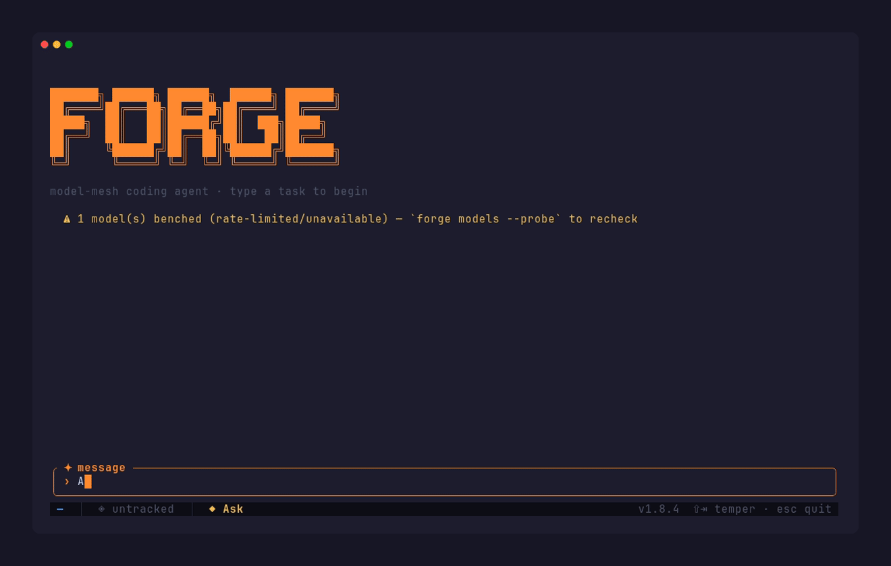

<div align="center">

# Forge

### The model-agnostic AI coding agent. One harness, every provider — routed to the cheapest model that can do the job, with automatic cross-provider failover.

**Run any model — or your existing Claude / Codex / Gemini subscription — through one fast Rust
harness that routes every task to the cheapest capable model, fails over across providers when one
is down, and is *measurably* more reliable than the raw vendor CLIs.**

[](https://github.com/florisvoskamp/forge/actions/workflows/ci.yml)
[](https://github.com/florisvoskamp/forge/releases)
[](./LICENSE)
[](https://www.rust-lang.org/)
[](docs/harness/why-forge-is-a-better-harness.md)

**[Install](#install)** &nbsp;·&nbsp; **[Quickstart](#quick-start)** &nbsp;·&nbsp; **[Free setup](#free-providers)** &nbsp;·&nbsp; **[Why Forge](#why-forge)** &nbsp;·&nbsp; **[Benchmarks](#benchmarks)** &nbsp;·&nbsp; **[vs. others](#comparison)** &nbsp;·&nbsp; **[Features](#feature-overview)** &nbsp;·&nbsp; **[Docs](#documentation)**

</div>

<p align="center"></p>

---

```bash
forge chat                                    # full-screen TUI, multi-turn
forge run "add pagination to the user list"   # one-shot task
forge run --model claude-cli::sonnet "…"       # run your Claude subscription THROUGH Forge
forge models --probe                           # discovered models, ranked, health-checked
forge lattice impact "UserRepository"          # code-graph blast radius
```

<a id="why-forge"></a>

## 🏆 Why Forge wins

Every other coding agent ties you to one vendor's models and one billing relationship. Forge doesn't.
It is **model-agnostic by design**: connect Anthropic, OpenAI, Google, Groq, NVIDIA, local Ollama —
or just the Claude/Codex/Gemini subscription you already pay for — and Forge's routing engine sends
**each task to the cheapest model that can do it well**, fails over to the next-best provider when one
is rate-limited or down, and conserves your metered subscriptions by spreading load onto free frontier
models. And because Forge can drive the *same* model you'd run with `claude` or `codex` directly, its
reliability layer is a **measured** advantage, not a marketing one: on SWE-bench Lite, the same `claude
sonnet` fixes **50% more bugs through Forge than through the raw CLI**.

- **Model Mesh** — one agent, every provider. Task-tier routing (trivial / standard / complex) to the
  cheapest capable model, benchmark-ranked, with cross-provider capability-aware failover.
- **Bring your subscription** — run your Claude Code / Codex / Antigravity (free Gemini) plan *through*
  Forge and get mesh routing, failover, and the reliability layer on top. No other agent does this.
- **A harness that doesn't lie** — an objective, tool-grounded completion gate, doom-loop and
  repeated-failure guards, and recovery of tool calls a model writes as prose. It never reports a
  phantom success — and there's a `cargo test` behind every one of those claims (324 conformance tests).
- **Built-in code intelligence** — Lattice: a tree-sitter symbol graph (9 languages) with blast-radius,
  call-chains, and semantic retrieval, auto-injected before each turn.
- **Cross-session memory** — durable, typed facts per project, auto-captured at turn end and
  relevance-ranked back into context next session — only the relevant ones, not a dump.
- **One fast static binary** — Rust, no Node/Python/Bun runtime, no Electron. Installs in one line.

---

<a id="the-mesh"></a>

## 🧠 The Mesh — model-agnostic intelligent routing

This is the wedge no other terminal agent has. You don't pick a model; you connect providers and let
Forge pick. Every task is classified into a tier, then routed to the **cheapest model that meets the
bar** — benchmark-ranked against real Artificial Analysis intelligence + coding scores.

| Tier | Examples | Goes to |
|------|----------|---------|
| **Trivial** | Single-line edits, simple lookups | Local / cheapest free model |
| **Standard** | Multi-file refactors, code review | Mid-tier cloud model |
| **Complex** | Architecture, deep debugging, new features | Frontier model |

**A concrete turn.** You ask Forge to "add OpenTelemetry tracing to the HTTP layer." Forge classifies
it as *complex*, picks the top-ranked frontier model your keys can reach, and starts. Mid-turn that
provider returns a per-minute 429. Instead of crashing or silently degrading, the mesh **waits out the
short reset and retries the best model**, then if it's still down, **fails over to the next-ranked
model across a different provider** — the whole catalog, not a fixed top-5. The trivial follow-up edits
it spins off get routed down to a **free** model (Groq, NVIDIA NIM) so your metered Claude/Codex quota
is spent only where it matters. Inspect any of these decisions live with `/mesh` or `forge mesh "<task>"`.

**Why it's robust under real free-tier conditions:**

- **Reset-aware rate limits** — a per-minute free-tier 429 is waited out and the *best* model retried,
  not immediately downgraded; transient 5xx blips retry the same model; permanent errors (no tool
  support / 402 payment-required) fail over at once.
- **Subscription conservation** — under budget pressure or to spare a metered plan, the mesh spreads
  standard/complex work onto free frontier models. `credit_mode = "strict"` keeps routing **free +
  subscription only** — a paid model is never silently used.
- **Multiple keys per provider** — run `forge auth <provider>` again to stack keys; the mesh
  round-robins across them to multiply a free tier's per-key rate limit.
- **`/effort`** (low / medium / high / xhigh) steers the *whole* route, benchmark-driven: higher effort
  biases toward stronger-benchmarked models only when the score gap is real, lower toward cheaper.

---

<a id="benchmarks"></a>

## 📊 Proof: same model, better results

The honest test of a harness: run the **same model** Forge bridges (`claude sonnet`) *through* Forge vs.
the raw `claude` CLI on **SWE-bench Lite** (real GitHub bug fixes), scored by the **official `swebench`
Docker evaluator**. The only difference is the harness.

| Same `sonnet` model · SWE-bench Lite | Bugs fixed | Tokens / fix |
|---|--:|--:|
| Raw `claude` CLI | 4 / 10 | 3.57M |
| **Forge** (loop-gated completeness) | **6 / 10** | **2.83M** |

**Forge fixes 50% more bugs (6 vs 4) at ~21% lower cost per fix** — and *strictly dominates*: every bug
the raw CLI fixed, Forge also fixed, plus two more; zero the other way. Total tokens are at parity —
Forge does more work because it solves more, not because it's wasteful. The larger N=20 run holds the
same direction (11 vs 9).

> Every number here is reproducible (`forge bench swe` + the official evaluator) and every reliability
> claim has a test. Full method, the larger-N run, and an explicit "where Forge does *not* win yet"
> section: **[Why Forge is a better harness →](docs/harness/why-forge-is-a-better-harness.md)**

---

<a id="comparison"></a>

## ⚖️ Forge vs. the alternatives

Accurate per cell, last verified mid-2026. The **bold rows are Forge-only** — no other terminal agent
does benchmark-ranked cost-tier routing across *independent* providers, cross-provider failover, *and*
subscription bridging in one binary. A full, sourced breakdown of every competitor (plus Copilot CLI,
Gemini CLI, Windsurf/Devin, and opencode) lives in **[docs/comparison.md](docs/comparison.md)**.

| Capability | **Forge** | Claude Code | Codex CLI | Cursor | Aider | Cline |
|---|:--:|:--:|:--:|:--:|:--:|:--:|
| Any model / any provider | ✅ | Anthropic only | OAI-compat¹ | Cursor's set | ✅ | ✅ |
| **Auto cost-tier routing** (cheapest capable model per task) | ✅ | ❌ | ❌ | ❌ | ❌ | ❌ |
| **Cross-provider failover** (down → next ranked, whole catalog) | ✅ | ❌ | ❌ | ❓ | ❌ | ❌ |
| **Run your *subscription* through it** (Claude/Codex/Gemini) | ✅ | own only | own only | ❌ | ❌ | grey² |
| Subscription conservation (spread off metered plans) | ✅ | ❌ | ❌ | ❌ | ❌ | ❌ |
| Local LLMs first-class (Ollama) | ✅ | proxy only | ✅ | ❌ | ✅ | ✅ |
| Anti-phantom-success completion gate, test-pinned | ✅ | internal | internal | ❓ | ❌ | ❌ |
| Queryable code-graph (blast-radius / call-chain) | ✅ | ❌ | ❌ | index³ | repo-map³ | ❌ |
| Parallel adversarial code-review crew | ✅ | ❌ | ❌ | ❌ | ❌ | ❌ |
| MCP client | ✅ | ✅ | ✅ | ✅ | ❌⁴ | ✅ |
| MCP server (expose itself to other tools) | ✅ | ✅ | ✅ | ❓ | ❌ | ❌ |
| Skills / Claude Code import | ✅ | ✅ | partial⁵ | ❌ | ❌ | partial⁵ |
| Open source | ✅ MIT | ❌ | ✅ Apache | ❌ | ✅ Apache | ✅ Apache |
| Single static binary (no runtime) | ✅ Rust | Node | ✅ Rust | closed | Python | Node (VS Code) |

<sub>¹ Codex CLI is OpenAI-leaning but reaches any OpenAI-compatible endpoint (incl. Ollama) via
`config.toml`; it does no automatic routing or failover. ² Cline added a wrapper to ride a Claude Max
subscription, but Anthropic's 2026 ToS enforcement blocked third-party consumer-credential use — status
uncertain, so not claimed. ³ Cursor indexes the repo; Aider builds a repo-map — neither is a queryable
symbol graph with blast-radius + call-chains. ⁴ Aider has no native MCP (issue #4506); MCP only via the
third-party AiderDesk GUI. ⁵ Codex CLI uses `AGENTS.md`/custom prompts and Cline uses workflows/rules —
neither imports Claude Code's skill format. Competitor capabilities evolve — corrections welcome via an
issue.</sub>

The shared rows (model-agnostic, open source, local LLMs) put Forge level with Codex CLI / Aider / Cline;
the bold rows — automatic cost-tier routing, cross-provider failover, and subscription bridging — are
Forge-only.

---

<a id="free-providers"></a>

## 🆓 Recommended free providers

Forge is **free to run with zero paid keys.** These providers all offer a genuine free tier with
high-quality models and usable rate limits — connect a few and the mesh routes across them, failing
over automatically when one is throttled. Keys are stored in your **OS keyring**, never in config.

> Connect each with `forge auth <name>` (reads the key from stdin). The model catalog is discovered
> live, so new free models appear automatically.

### ⭐ Start here (fast + frontier, best limits)

| Provider | Best free models | Free limits | Get a key | Connect |
|----------|------------------|-------------|-----------|---------|
| **Groq** | Llama-3.3-70B, Qwen3-32B, GPT-OSS-120B | ~30 RPM · 1K/day | [console.groq.com/keys](https://console.groq.com/keys) | `forge auth groq` |
| **NVIDIA NIM** | DeepSeek-R1, Llama-3.1-405B, Nemotron-Ultra-550B, GPT-OSS-120B (100+ models) | ~40 RPM | [build.nvidia.com](https://build.nvidia.com/) | `forge auth nvidia` |
| **Cerebras** | GPT-OSS-120B, Qwen-3-Coder-480B, Llama-3.3-70B | ~30 RPM · 14.4K/day | [cloud.cerebras.ai](https://cloud.cerebras.ai/) | `forge auth cerebras` |

### ➕ Add for breadth (big context, more frontier models)

| Provider | Best free models | Free limits | Get a key | Connect |
|----------|------------------|-------------|-----------|---------|
| **Google Gemini** (AI Studio) | Gemini Flash (1M context), Gemma | 15 RPM · 1.5K/day | [aistudio.google.com/apikey](https://aistudio.google.com/apikey) | `forge auth gemini` |
| **SambaNova** | DeepSeek-V3.1, Llama-4 Maverick, Llama-3.3-70B | ~20 RPM | [cloud.sambanova.ai](https://cloud.sambanova.ai/) | `forge auth sambanova` |
| **Mistral** | Mistral Large 3, Codestral, Magistral | ~1 RPS · 500K TPM | [console.mistral.ai/api-keys](https://console.mistral.ai/api-keys) | `forge auth mistral` |

### 🧩 Optional (aggregators + niche)

| Provider | Best free models | Free limits | Get a key | Connect |
|----------|------------------|-------------|-----------|---------|
| **OpenRouter** | rotating `:free` models (Qwen3-Coder, DeepSeek-R1, Llama-3.3) | 20 RPM · 200/day | [openrouter.ai/keys](https://openrouter.ai/keys) | `forge auth openrouter` |
| **GitHub Models** | GPT-4.1, o4-mini, Llama-4-Scout | 10 RPM · 50/day | [github.com/marketplace/models](https://github.com/marketplace/models) | `forge auth github_copilot` |
| **Cohere** | Command A (218B), Command R+ | 20 RPM · 1K/month | [dashboard.cohere.com/api-keys](https://dashboard.cohere.com/api-keys) | `forge auth cohere` |

**A solid all-free setup:** `groq` + `nvidia` + `gemini` — fast small-task routing, 100+ frontier
models, and a 1M-context model, all at \$0. Add `cerebras`/`sambanova` for more headroom under load.

**Stack multiple keys per provider to multiply free limits.** Run `forge auth <provider>` again to add
another key — Forge round-robins across all of them, so two free Groq keys ≈ double the requests/min,
and a throttled key's retry lands on the next one. Works for every provider (except CLI bridges).

```bash
forge auth groq            # add a key
forge auth groq            # add another → Forge rotates across both
forge auth groq --list     # "groq: 2 key(s) configured — …aB3x, …9kQ2"  (masked)
forge auth groq --replace  # overwrite all with one key
```

You can also stack keys via env: `GROQ_API_KEY="k1,k2"` or numbered `GROQ_API_KEY_2`, `GROQ_API_KEY_3`.

> Rate limits and free model lists shift month-to-month — these are mid-2026 figures; check each
> provider's page for current terms. See [docs/features/free-models.md](docs/features/free-models.md)
> for tier config and how to add any other OpenAI-compatible provider in one line.

---

<a id="feature-overview"></a>

## ✨ Feature highlights

**💸 Routing & Cost**
- Auto-discovery of every model your keys can reach; cost-tiered routing (trivial / standard / complex)
- Benchmark ranking against real Artificial Analysis intelligence + coding scores
- Health-aware, capability-aware failover down the full ranked catalog
- Subscription conservation + `credit_mode = "strict"` (free + subscription only)
- Daily / weekly / monthly budget caps; auto-downshift under pressure
- Reset-aware rate-limit handling; multiple keys per provider with round-robin rotation
- `/effort` slider that steers the whole mesh route, not just a provider's reasoning param
- Prompt caching, per-model pricing fetched from OpenRouter, persistent cross-restart usage store

**🤖 Agentic Coding**
- Objective, tool-grounded completion gate — never reports a phantom success
- Doom-loop + repeated-failure guards; recovery of tool calls written as prose
- Lattice code intelligence: tree-sitter symbol graph (9 languages), blast-radius, call-chains,
  semantic embeddings, auto-injected before each turn
- Planning mode (`/plan` read-only → `/execute`); Architect mode (strong planner + cheap editor)
- Live LSP diagnostics fed back after edits; opt-in autofix loop (lint/test self-heal)
- Subagent fan-out (`spawn_agents`), mesh-routed children, opt-in git-worktree isolation
- Assay: parallel adversarial critic crew with ranked, refuter-verified findings + CI gate
- Cross-session auto-memory: typed durable facts, relevance-ranked recall
- Vision input (`/image` or paste); `@file` context injection

**🔌 Ecosystem / Interop**
- 17+ providers including Anthropic, OpenAI, Ollama, Groq, Gemini, DeepSeek, OpenRouter, NVIDIA NIM,
  SambaNova, Mistral, Cohere, xAI, Cerebras — any OpenAI-compatible endpoint in one config row
- Subscription bridges: Claude Code CLI, Codex CLI, Antigravity CLI (free Gemini)
- MCP client (stdio + HTTP/SSE, OAuth 2.0 + PKCE) **and** MCP server (expose Forge to other tools)
- Skills + commands (Claude Code format compatible); `forge import` / `forge skill export` round-trip
- `forge migrate` packs a whole install (config + skills + MCP + hooks) into a `.tar.gz` to move to another machine — imported skills auto-normalized (claude/codex → forge paths)
- `forge skill install owner/repo[@ref]` from GitHub; `forge plugin install/add/list/remove` for plugin/skill-packs
- Pre/post tool-use hooks — block, observe, rewrite args, or inject model-visible context

**🎨 TUI / UX**
- Full-screen ratatui TUI: scrollable transcript, pinned panels, live progress, cost meter
- Context-window token gauge, fuzzy command palette, dynamic `/config` settings editor
- Unified activity viewer (subagents + critics), session/checkpoint pickers
- `/usage` + `/mesh` overlays, `/model` picker, `/effort` knob, customizable statusline & keybinds
- Remote control: drive a session from a phone/desktop browser (`/remote`)
- `--inline` for native scrollback; `--mock` offline deterministic provider (no key needed)

**🔒 Safety**
- Permission broker with per-tool rules and four tempers (Read-only / Ask / Auto-edit / Full)
- `Auto-edit` (accept-edits) auto-approves file writes **and** shell commands; the unoverridable denylist still blocks catastrophic ops (`rm -rf /`, `.env` reads, pipe-to-sh)
- Answering `a` (always) at a prompt persists for the rest of the session — that tool won't prompt again until restart — and is saved to config
- Diff preview before every write; shadow file snapshots; `/undo` with file restore
- Per-turn checkpoints; full audit trail of tool calls, routing, and permission outcomes
- Unoverridable denylist; opt-in OS shell sandbox (Linux Landlock)

> **Why a harness, not just a CLI?** Forge can run the *same* model you'd run with `claude`/`codex`
> directly — so the harness is the only difference. Real models loop, write tool calls as prose that
> never execute, emit malformed output, and claim "done" without checking; a raw CLI loop mostly spins,
> crashes, or phantom-succeeds on these. Forge turns each into a bounded, test-pinned outcome.
> **[Why Forge is a better harness](docs/harness/why-forge-is-a-better-harness.md)**.

---

<a id="install"></a>

## 📦 Install

### ⚡ One-line install (recommended)

```bash
curl -fsSL https://raw.githubusercontent.com/florisvoskamp/forge/main/install.sh | sh
```

Detects your OS/arch, downloads the matching release binary (verifying its SHA-256), and installs
`forge` to `~/.local/bin`. Override with `FORGE_VERSION` (a tag) or `FORGE_INSTALL_DIR`. Linux x86-64
and macOS (Apple Silicon + Intel) are supported; on other arches it falls back to building from source.

### 🪟 Windows (PowerShell)

```powershell
irm https://raw.githubusercontent.com/florisvoskamp/forge/main/install.ps1 | iex
```

Downloads the x86-64 release binary (verifying its SHA-256), installs `forge.exe` to
`%LOCALAPPDATA%\Programs\forge`, and adds it to your user `PATH`. After install, `forge update` keeps it
current.

### 🍺 Homebrew

```bash
brew tap florisvoskamp/forge https://github.com/florisvoskamp/forge
brew install forge
```

### 🦀 Cargo (crates.io)

```bash
cargo install adforge
```

Installs the latest published release from crates.io. The crate is published as `adforge`; the
installed binary is still `forge`.

### 🔨 From source

```bash
cargo build --release          # produces target/release/forge
cp target/release/forge ~/.local/bin/   # or anywhere on PATH
```

Requires a recent stable Rust toolchain. Prebuilt binaries for each OS are on the
[**Releases**](https://github.com/florisvoskamp/forge/releases) page.

---

<a id="quick-start"></a>

## 🚀 Quick Start

```bash
# Guided setup: API keys + subscription plans + optional local LLM
# (runs automatically on first launch; re-run anytime)
forge setup

# Optional: run a local model that fits your machine (via Ollama)
forge local                 # animated menu; or: forge local install

# Interactive chat (full-screen TUI; --inline for native scrollback)
forge chat
# In chat: /config edits any setting · /model picks a model · /effort sets the reasoning/route knob
#          /remember <fact> saves a memory · /memories lists them · /init writes .forge/AGENTS.md

# One-shot task
forge run "refactor the auth middleware to use tower layers"

# See discovered models + auto-pick per tier
forge models

# Index your codebase
forge lattice update .
forge lattice query "authenticate"
```

No API key required to test — `--mock` runs an offline deterministic provider:

```bash
forge run --mock "hello"
forge chat --mock
```

---

## ⌨️ CLI Reference

### 💬 `forge chat` — interactive TUI

```bash
forge chat
forge chat --resume abc123                      # resume a previous session
forge chat --continue                           # resume the most recent session
forge chat --model anthropic::claude-opus-4-8   # pin a model
forge chat --mode accept-edits                  # auto-allow file writes
forge chat --inline                             # inline scrollback instead of full-screen
forge chat --plain                              # headless / CI mode
```

The TUI is full-screen by default (scrollable transcript, pinned panels, mouse-wheel scroll). Use
`--inline` (or `[tui] fullscreen = false`) for classic inline-scrollback. `Ctrl+O` opens the activity
viewer (main chat + subagents + critics).

**In-session slash commands:**

| Command | Description |
|---------|-------------|
| `/orchestrate <task>` | Route a task through the best available resources — skills, subagents, MCP, web, Lattice, or direct |
| `/plan <task>` | Planning mode — investigate read-only and propose a plan (no edits) |
| `/execute` | Approve the proposed plan and carry it out (aliases `/approve`, `/go`) |
| `/init` | Scan the repo and write `.forge/AGENTS.md` project memory |
| `/new` · `/resume [id]` · `/sessions` | Start fresh · resume · browse past sessions |
| `/undo` · `/checkpoint [label]` · `/checkpoints` | Revert last turn · save · rewind to a checkpoint |
| `/compact` | Summarize older context to free the window (also auto-triggers at 80% gauge) |
| `/mode` · `/model [<id>]` · `/models` | Switch temper · pin a model · browse all discovered models |
| `/usage` · `/mesh [task]` | API spend + token usage · inspect mesh routing |
| `/mcp [server]` | Show MCP server status (or one server's tools) |
| `/assay [--diff\|--branch <b>\|--since <ref>\|<path>] [--only/--skip <lens,…>]` | Run code-quality analysis crew |
| `/goal <objective>` · `/loop <task>` | Set a persistent goal · run autonomously until complete (≤25 turns) |
| `/replay <id> [<id2>]` | Show a session transcript, or diff two sessions |
| `/lattice <symbol>` · `/image <path>` · `/thinking` | Query code intel · attach image · toggle reasoning blocks |
| `/remember <text>` · `/memories` | Save a memory · list what Forge knows |
| `/remote [--lan\|--local\|--anywhere]` | Toggle browser remote control |
| `/config` | Dynamic settings editor — fuzzy-search + edit any setting (and API keys) |
| `/statusline [layout\|toggle <widget>\|reset\|edit]` | Manage the statusline — toggle/reorder widgets, or reset to default |
| `/` | Open command palette (fuzzy-find skills + commands) |

**Keyboard shortcuts:** `SHIFT+TAB` cycle temper · `Ctrl+O` activity viewer · `Ctrl+J` newline ·
`Esc` cancel/stop · `↑/↓` navigate · `y/n/a` allow/deny/always-allow a permission prompt.

### ▶️ `forge run` — single non-interactive turn

```bash
forge run "add tests for the payment service"
forge run --tui "debug the startup crash"      # with live TUI
forge run --mode bypass "apply all the diffs"  # no prompts
```

### 🩺 Setup, health, models, memory

```bash
forge setup              # guided: API keys + subscription plans + optional local LLM
forge doctor             # diagnose config, providers/keys, bridges, Ollama, git, terminal
forge models             # catalog overview + auto-pick per tier
forge models --probe     # recheck only benched/excluded models (cheap)
forge models --clear     # forget all benched/rate-limited marks
forge memory             # list this project's auto-memories
forge memory add "use 4-space indent" --kind decision
forge mesh "<task>"      # explain how a task would route
```

### 🖥️ `forge local` — local LLMs via Ollama

```bash
forge local              # animated menu, benchmark-ranked (install / start / status)
forge local detect       # specs + every model that fits, ranked by benchmark score
forge local install      # install the top-ranked model (installs Ollama if missing)
forge local start [tag]  # ensure the runtime + model are up
```

### 🕸️ `forge lattice` — code intelligence

```bash
forge lattice update .               # (re)index, incremental by content hash
forge lattice query "UserRepository" # find symbol by name
forge lattice impact "UserService"   # blast radius — what depends on it
forge lattice path "main" "persist"  # shortest call chain A → B
forge lattice why "authenticate"     # git provenance — who last changed it
```

### 🧰 Audit, migrate, MCP, skills

```bash
forge sessions               # list sessions, newest first
forge replay abc123          # reconstruct turn-by-turn transcript (--json to export)
forge assay run --scope diff --fail-on high   # headless code-quality gate for CI
forge commands               # list discovered commands + skills
forge import claude          # migrate ~/.claude commands/skills/agents
forge import codex           # migrate ~/.codex/prompts as commands
forge skill export ./bundle  # export your commands/skills/agents (inverse of import)
forge skill install owner/repo[@ref]   # install skills from a GitHub repo (branch/tag/SHA)
forge skill normalize        # rewrite ~/.claude paths + claude/codex refs in imported skills
forge plugin install owner/repo        # install a Forge plugin / skill-pack from GitHub
forge plugin add <name> <path>         # register a local plugin directory
forge plugin list            # list installed plugins
forge plugin remove <name>   # uninstall a plugin
forge mcp                    # MCP server status
forge mcp import             # wizard: scan installed AI CLIs for MCP configs
forge mcp add <name> [--transport stdio|http|sse] [-s local|user|project] [-e KEY=VAL] [--header K=V] [--url URL] [-- cmd args]
forge mcp remove <name>      # remove an MCP server by name
forge mcp get <name>         # show config for one MCP server
forge migrate export ./bundle.tar.gz [--include-sessions] [--include-keys]   # move install to another machine (.tar.gz)
forge migrate push user@server                                        # one-step over SSH
forge auth anthropic         # store an API key in the OS keyring
forge git setup              # install the model-aware co-author commit hook
```

---

## 🎨 Customizable Statusline

The statusline is a row of **widgets** you can add, remove, or reorder — live with `/statusline` or in config:

```toml
# ~/.forge/config.toml  (or .forge/config.toml for project scope)
[statusline]
widgets = ["model", "mode", "tokens", "cost", "git_branch", "mcp_count", "clock"]
```

Available widgets: `model`, `mode`, `tokens`, `cost`, `git_branch`, `mcp_count`, `session`, `clock`.
`/statusline layout` shows the current order · `/statusline toggle <widget>` adds/removes one ·
`/statusline reset` restores the default · `/statusline edit` opens the raw config line. Changes apply
immediately and persist to your config.

---

## ⚙️ Configuration

Layered config — defaults → user → project → env vars:

| Layer | Path |
|-------|------|
| User | `~/.config/forge/config.toml` |
| Project | `./.forge/config.toml` |
| MCP servers | `./.forge/mcp.toml` |
| Agent types | `./.forge/agents/<name>.toml` |
| Project memory | `./.forge/AGENTS.md` |
| Env override | `FORGE_*` prefix |
| API keys | OS keyring (via `forge auth`) |

Key sections: `[mesh]` (routing, budget, conservation, failover), `[permissions]` (per-tool rules),
`[lattice]` (indexing + embeddings), `[shell]` (sandbox + error interceptor), `[[hooks]]`, `[mcp]`,
`[git]`, `[assay]`, `[statusline]` (widget layout), `[local]`.

```toml
[mesh]
daily_budget_usd = 5.0
monthly_cap_usd = 50.0
credit_mode = "strict"        # route to free + subscription only
auto_orchestrate = true       # apply the orchestration framework on every turn
```

---

## 🔌 Extending Forge

**MCP** — connect any MCP server (stdio or HTTP/SSE) in `.forge/mcp.toml`; tools are exposed as
namespaced `ToolSpec`s through the permission broker. OAuth 2.0 + PKCE for protected servers. Import
existing configs from Claude Code, Cursor, Windsurf, VS Code, or Codex with `forge mcp import`. Forge is
also an MCP **server**, exposing its own tools to other agents.

```toml
[[servers]]
name = "github"
transport = "stdio"
command = "npx -y @modelcontextprotocol/server-github"
[servers.allowlist]
tools = ["create_issue", "list_prs"]
```

**Skills & commands** — reusable prompt templates (commands) and methodology guides (skills) as markdown
files. Claude Code's `~/.claude/commands` and `~/.claude/skills` format is compatible — import directly
with `forge import claude`. Scope precedence: Project shadows User shadows Builtin.

**Hooks** — run shell commands around tool calls; `pre_tool_use` can block, rewrite args, or inject
model-visible context, `post_tool_use` observes. Both fire on the direct path and the CLI-bridge path,
including MCP calls.

```toml
[[hooks]]
event = "pre_tool_use"
tool_pattern = "shell"
command = "bash -c 'jq .args <<< $FORGE_TOOL_INPUT >> audit.log'"
```

---

<a id="documentation"></a>

## 📚 Documentation

| Doc | What |
|-----|------|
| [**Competitor comparison**](./docs/comparison.md) | Detailed, sourced breakdown of every alternative |
| [**Why Forge is a better harness**](./docs/harness/why-forge-is-a-better-harness.md) | The test-backed case — incl. where Forge does *not* win |
| [**Benchmark results**](./docs/benchmarks/results.md) | Measured SWE-bench numbers, method, and honest caveats |
| [`docs/benchmarks/swe-bench.md`](./docs/benchmarks/swe-bench.md) | Reproduce the benchmark yourself (`forge bench swe`) |
| [`docs/architecture/02-architecture.md`](./docs/architecture/02-architecture.md) | System design with C4 diagrams |
| [`docs/features/`](./docs/features/) | Per-feature design docs |
| [`CONTRIBUTING.md`](./CONTRIBUTING.md) | How to build, test, and contribute |

---

## 🗂️ Project Layout

```
crates/
├── forge-cli        # binary, clap commands, init wizard, TUI render loop
├── forge-core       # agent loop, session lifecycle, permission broker
├── forge-mesh       # model router — classification, ranking, health, failover, budget
├── forge-provider   # provider trait — Anthropic, OpenAI, Ollama, CLI bridges
├── forge-tools      # tool registry — read, write, edit, shell, search, web
├── forge-store      # SQLite persistence — sessions, messages, usage, pricing, tasks
├── forge-tui        # ratatui renderer + headless presenter
├── forge-config     # layered config + OS keyring secret resolution
├── forge-index      # Lattice — tree-sitter extraction, graph, embeddings
├── forge-mcp        # MCP client — rmcp, meta-tools, allowlist, OAuth
├── forge-skills     # skills + commands catalog, CC-format reader
└── forge-types      # shared domain types
```

---

## 🤝 Contributing

Issues and PRs welcome. See [`CONTRIBUTING.md`](./CONTRIBUTING.md) for how to build, test, and submit
changes, and [`CODE_OF_CONDUCT.md`](./CODE_OF_CONDUCT.md). Competitor-comparison corrections are
especially welcome — open an issue with a source.

## 📄 License

[MIT](./LICENSE) © 2026 Floris Voskamp
</content>
