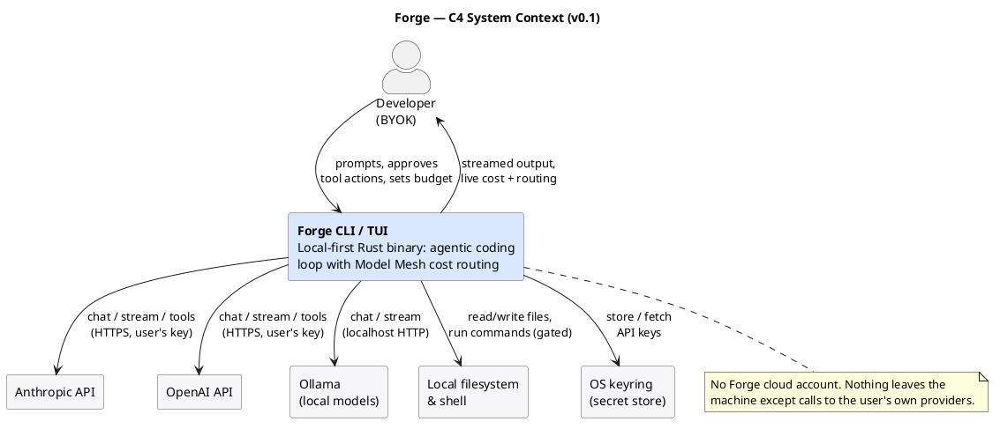
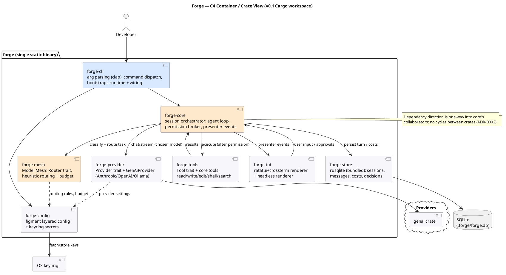
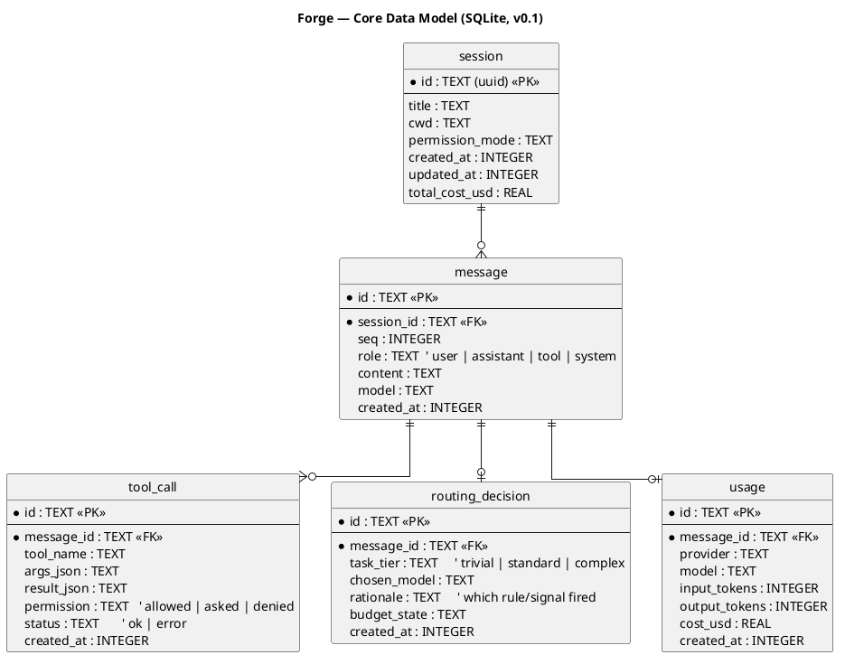
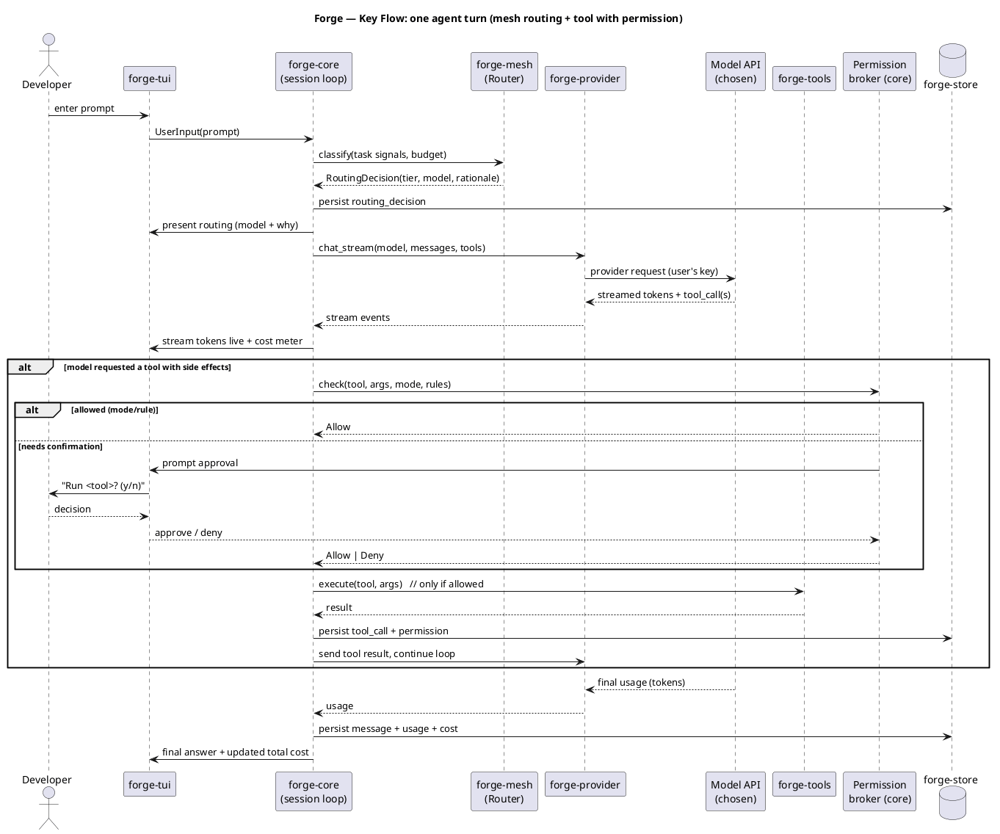

# Architecture — Forge

> Living document. Update it (and add an ADR) when the build changes the design.
> **Complexity tier: platform** (broad roadmap), built **monolith-first** (ADR-0002).
> Traces to [`01-requirements.md`](./01-requirements.md). Decisions in
> [`decisions/`](./decisions/).

## 1. Overview & chosen stack

Forge is a **local-first, single-binary Rust CLI/TUI** that runs an agentic coding loop
against multiple model providers, with a **Model Mesh** that routes each task to the
cheapest capable model under a budget. It is structured as a **modular monolith** — a
Cargo workspace of small library crates with compiler-enforced seams, assembled by one
thin binary — so the broad roadmap (code memory, multi-agent, MCP, marketplace) can be
added without core rewrites, while still shipping as one static executable.

All technology choices were verified against current releases as of **June 2026** (see
ADRs for sources/versions).

| Layer | Choice (version, 2026-06) | ADR |
|-------|---------------------------|-----|
| Language / runtime | Rust (stable) + Tokio 1.52 async | [ADR-0001](decisions/0001-rust-and-tokio-async-runtime.md) |
| Code structure | Modular monolith, Cargo workspace, single binary | [ADR-0002](decisions/0002-modular-monolith-single-binary.md) |
| Model providers | Own `Provider` trait + `genai` 0.6 backend (Anthropic/OpenAI/Ollama) | [ADR-0003](decisions/0003-provider-abstraction-via-genai.md) |
| TUI | ratatui 0.30 + crossterm 0.29; headless mode | [ADR-0004](decisions/0004-tui-ratatui-crossterm.md) |
| Persistence | rusqlite 0.40 (bundled SQLite) | [ADR-0005](decisions/0005-persistence-rusqlite-bundled.md) |
| Model Mesh | rule-based heuristic `Router` (pluggable) | [ADR-0006](decisions/0006-model-mesh-rule-based-routing.md) |
| Config / secrets | figment 0.10 layered config + keyring 4.0 (env-first) | [ADR-0007](decisions/0007-config-figment-secrets-keyring.md) |
| Tool safety | permission modes + per-tool rules, central broker | [ADR-0008](decisions/0008-tool-permission-modes.md) |
| CLI / errors / logging | clap 4.6 · thiserror 2.0 + anyhow · tracing 0.1 | — (conventional) |

## 2. System context (C4 level 1)



One actor: the **developer**, bringing their own API keys (BYOK). Forge runs entirely on
their machine. The only outbound traffic is to the model providers the user configures
(Anthropic, OpenAI over HTTPS; Ollama on localhost). Forge also touches the **local
filesystem/shell** (via gated tools) and the **OS keyring** (for secret storage). There
is no Forge cloud, account, or telemetry in v0.1.

## 3. Containers / crates (C4 level 2)



The binary is a Cargo workspace. Dependencies flow one way; there are no cycles between
crates (ADR-0002). `forge-core` is the orchestrator that the surfaces (TUI/headless) and
subsystems (mesh, provider, tools, store) attach to.

## 4. Components & boundaries

| Crate | Responsibility (one line) | Talks to |
|-------|---------------------------|----------|
| `forge-cli` | Binary entry: clap parsing, command dispatch, runtime bootstrap, dependency wiring | core, config |
| `forge-core` | Session orchestrator: the agent loop, permission broker, emits presenter events | tui, mesh, provider, tools, store |
| `forge-mesh` | Model Mesh: `Router` trait + heuristic router; task classification, budget-aware tier→model selection, records rationale | config |
| `forge-provider` | `Provider` trait + `GenAiProvider` (genai-backed): chat, streaming, tool calls, usage/cost extraction | genai, config |
| `forge-tools` | `Tool` trait + core tools (read/write/edit/shell/search/list); declares side-effect class + JSON schema | core (for results) |
| `forge-store` | rusqlite persistence: sessions, messages, tool calls, routing decisions, usage; migrations; blocking isolation | SQLite file |
| `forge-tui` | ratatui+crossterm interactive renderer **and** headless line/JSON renderer behind one presenter interface | core |
| `forge-config` | figment layered config + secret resolution (env → keyring); per-OS paths | keyring |

**Why these seams.** Boundaries follow the *domain* of the problem, not frameworks
(DDD bounded contexts): "talking to a model", "deciding which model", "doing things in the
world (tools)", "remembering", "showing the user", "knowing the settings" are genuinely
separate concerns with separate reasons to change. Each is a trait-fronted crate so the
roadmap's recurring shape — *add another provider / tool / router / surface* — is a new
impl behind an existing trait, not a core edit (extensibility NFR). `forge-core` holds the
one thing that must be central: the orchestration + the security chokepoint (permission
broker).

## 5. Data model



| Entity | Owned by | Stored in | Notes |
|--------|----------|-----------|-------|
| `session` | forge-core | SQLite | one interactive session; carries cwd, permission mode, running cost |
| `message` | forge-core | SQLite | ordered turn entries (user/assistant/tool/system) |
| `tool_call` | forge-tools/core | SQLite | per tool invocation: args, result, permission outcome, status |
| `routing_decision` | forge-mesh | SQLite | the Mesh's choice + rationale + budget state, per assistant turn |
| `usage` | forge-provider | SQLite | tokens + computed cost per provider call |

Single-writer, single-machine: SQLite in **WAL mode** for crash-resilient writes
(reliability NFR). All writes go through `forge-store`; consistency needs are modest (one
session writer), so a connection-per-process with serialized writes suffices.

## 6. Key flow — one agent turn



The riskiest, most representative interaction: prompt → **Mesh routes** (records why) →
**provider streams** tokens/tool-calls → any side-effecting tool passes the **permission
broker** (mode + rules; may prompt the user) before executing → results feed back into the
loop → final usage/cost persisted and shown. This single flow exercises every crate and is
the **walking skeleton** target for Phase 4.

## 7. NFR strategy (how the design meets the quality attributes)

| Attribute (from requirements) | How the design achieves it |
|-------------------------------|----------------------------|
| Performance / startup (<100 ms) | Native Rust, single binary, no runtime; lazy-init subsystems; bundled SQLite (no lib lookup) |
| Streaming responsiveness | Tokio `select!` loop; provider stream events pushed straight to presenter |
| Footprint / portability | One static binary (bundled SQLite, crossterm); 3-OS CI matrix; no system deps |
| Security | Single permission broker gates all side effects (ADR-0008); secrets via env+keyring, never in config/logs (ADR-0007); BYOK, no telemetry |
| Cost-correctness | `usage` recorded per call from provider token counts; bundled+overridable pricing tables; budget checked inside the router before each call (ADR-0006) |
| Reliability | Graceful provider/tool failure → retry/fallback tier; WAL SQLite; session state persisted per turn so a crash resumes |
| Maintainability / extensibility | Trait-fronted crates, one-way deps, no cycles; add provider/tool/router/surface = new impl behind a trait |
| Observability | `tracing` structured logs + a persisted decision log (routing, permission, usage); debug trace mode; foundation for future session replay |
| Usability | Zero-config defaults; works after one API key; headless mode for pipes/CI |

## 8. Repository & directory structure

```
forge/
├── Cargo.toml                # workspace manifest (members below)
├── crates/
│   ├── forge-cli/            # binary: clap, dispatch, wiring  -> produces `forge`
│   ├── forge-core/           # session loop, permission broker, presenter events
│   ├── forge-mesh/           # Router trait + heuristic router + budget
│   ├── forge-provider/       # Provider trait + GenAiProvider (genai)
│   ├── forge-tools/          # Tool trait + core tools
│   ├── forge-store/          # rusqlite store + migrations
│   ├── forge-tui/            # ratatui/crossterm + headless renderers
│   └── forge-config/         # figment config + keyring secrets
├── docs/
│   └── architecture/         # this doc, requirements, ADRs, diagrams (.puml + .png)
├── .github/workflows/ci.yml  # fmt + clippy + test/build (3-OS matrix)
├── CONTRIBUTING.md  README.md  LICENSE  .gitignore
```

Allowed dependency direction: `forge-cli → forge-core → {mesh, provider, tools, store,
tui}`; everything may depend on `forge-config`; nothing depends on `forge-cli`. No cycles.

## 9. Cross-cutting decisions

- **Config & secrets:** layered figment (defaults → user → project → `FORGE_*` env);
  secrets resolved env→keyring, never persisted to config or logs (ADR-0007).
- **Error handling:** libraries return typed errors via `thiserror`; the binary
  (`forge-cli`) uses `anyhow` at the top level for context-rich reporting. Internal
  can't-fail paths stay panic-free but unguarded (per house style).
- **Tool/provider extension contract:** implementing the `Tool` / `Provider` / `Router`
  trait is the only thing needed to add one; no registry edits in core beyond
  registration wiring.
- **Testing strategy:** unit tests per crate (router heuristics, permission precedence,
  cost math, config layering — all pure and highly testable); a mock `Provider` for
  deterministic core-loop tests; the walking skeleton as the first integration test. CI
  runs fmt + clippy (`-D warnings`) + tests + release build on Linux/macOS/Windows.
- **Versioning:** SemVer; conventional commits; `main` protected, squash-merge, linear.

## 10. Risks & open questions

| Risk / question | Impact | Plan to de-risk |
|-----------------|--------|-----------------|
| `genai` is 0.x — API churn or a missing provider-specific feature (e.g. Anthropic caching/thinking) | Medium | Own `Provider` trait isolates it (ADR-0003); pin version; native adapter escape hatch if needed |
| Routing heuristics mis-tier tasks vs human judgement | Medium | Deterministic + user overrides/pin; tune default rule pack; classifier is a later pluggable `Router` |
| Cost accuracy depends on provider pricing tables that change | Medium | Pricing bundled **and** user-overridable; no release needed to correct prices (A-7) |
| TUI streaming + tool prompts + Tokio interplay is the integration-heavy part | High | **Walking skeleton first** (Phase 4): thinnest end-to-end turn through every crate before features |
| keyring unavailable on headless Linux | Low | env vars are the always-available fallback (ADR-0007) |
| ratatui/crossterm 0.x churn | Low | Contained in `forge-tui` behind presenter; pin versions |
